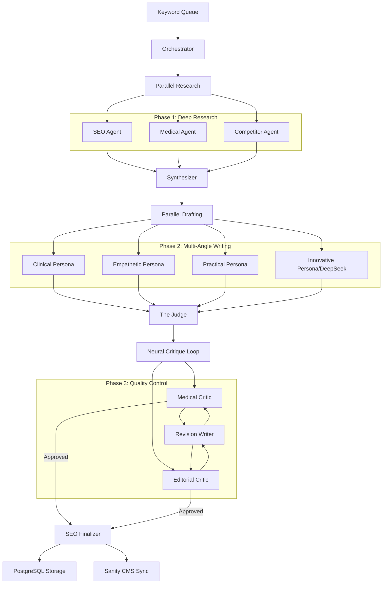

# Zappy Autonomous Content Factory (v2)

A powerful, multi-agent autonomous system for generating medical-grade SEO content, built on **Encore.dev** with a distributed neural architecture.

## 🧠 Distributed Agent Architecture

The system operates using a sophisticated multi-stage pipeline where specialized AI agents collaborate to research, draft, and refine content.



## ✨ New in v2.0
- **Encore.dev Backend**: Migrated to a high-performance, type-safe backend as a service.
- **Article Editing Suite**: Direct manual refinement via a premium UI modal with markdown support.
- **Token Telemetry**: Real-time tracking of generation costs (input + output tokens) stored per-article.
- **Neural Circuit Visualization**: Real-time "Swarm" visualizer showing agent thoughts and movements.
- **DeepSeek Integration**: Support for DeepSeek-V3 for innovative writing angles.

## 🛠️ Tech Stack
- **Backend**: [Encore.dev](https://encore.dev) (TypeScript)
- **Database**: PostgreSQL (Managed)
- **AI Models**: Claude 3.5 Sonnet & DeepSeek-V3
- **Frontend**: Vanilla JS + Tailwind CSS + Marked.js
- **Deployment**: Encore Cloud (Backend) + Vercel (Frontend)

## 🚀 Getting Started

### 1. Prerequisites
- [Encore CLI](https://encore.dev/docs/install)
- [Anthropic API Key](https://console.anthropic.com/)
- [DeepSeek API Key](https://platform.deepseek.com/)

### 2. Installation
```bash
git clone https://github.com/WimpyvL/zappy-seo-engine.git
cd zappy-seo-engine
npm install
```

### 3. Environment Variables
Add the following to your `.env`:
```env
ANTHROPIC_API_KEY=your_key
DEEPSEEK_API_KEY=your_key
```

### 4. Running Locally
```bash
encore run
```
The dashboard will be available at `http://localhost:4000/ui`.

## 📊 Token Usage & Economics
The factory now audits every generation. Total tokens are aggregated across all 6 phases:
1. **Research**: ~9k tokens
2. **Synthesis**: ~6k tokens
3. **Drafting**: ~30k tokens (parallel drafts)
4. **Judging**: ~4k tokens
5. **Critique**: ~10k tokens/loop
6. **Finalization**: ~8k tokens

Average total cost per medical insight: **60k - 80k tokens**.

## 🛡️ Medical Quality Standards
Every article must pass:
- **Medical Critic**: Zero dangerous claims, mandatory citations, clear clinical disclaimers.
- **Editorial Critic**: Clarity score >= 8/10, tone check for "Radical Empathy".
- **The Judge**: Cross-references the original research brief for coverage completeness.

---
*Built for Zappy Health — Redefining high-fidelity medical content automation.*
